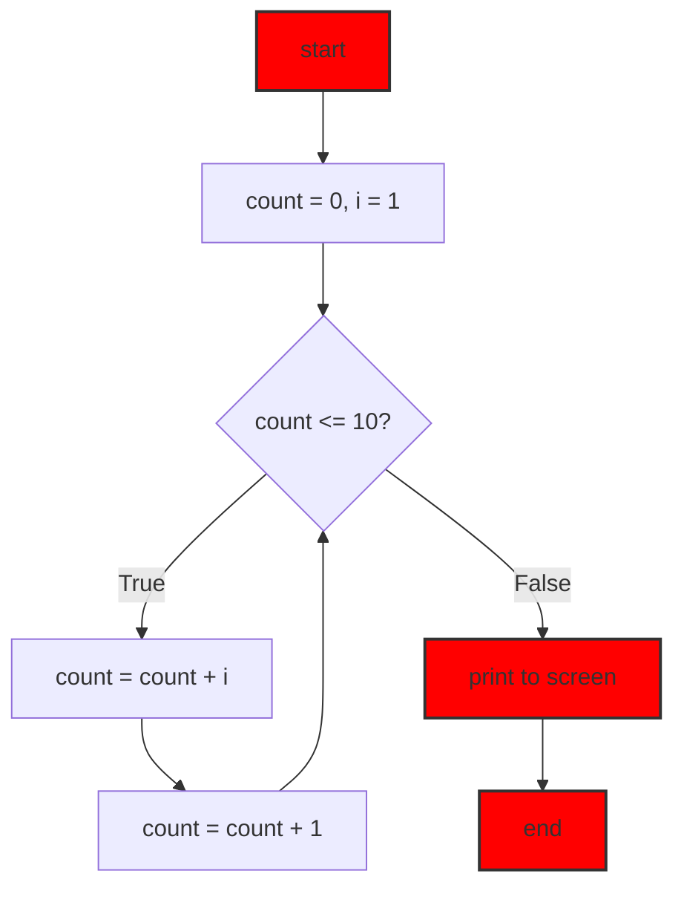

```mermaid
flowchart TD
    A[start] --> B[count = 0, i = 1]
    B --> C{count <= 10?}
    C -- True --> D[count = count + i]
    D --> E[count = count + 1]
    E --> C
    C -- False --> F[print to screen]
    F --> G[end]
 

classDef startStyle fill:#FF0000,stroke:#333,stroke-width:2px,border-radius:10px;
class A startStyle;
classDef startStyle fill:#FF0000,stroke:#333,stroke-width:2px,border-radius:10px;
class F startStyle;

class startStyle fill:#C2C2C2,stroke:#333,stroke-width:2px,border-radius:10px;
class G startStyle;

```

